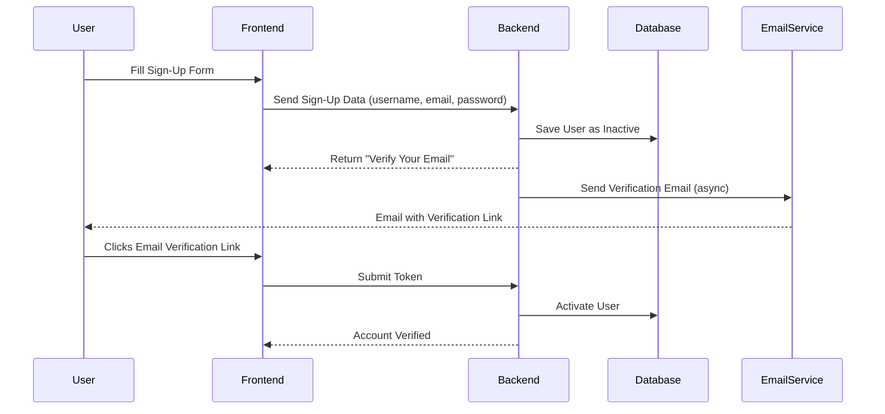

# 📈 Sequence Diagram – Sign-Up + Email Verification

This diagram models the interaction flow between a user and system components during the sign-up and email verification process.

---

## ✅ Notes

- **Arrows (`->>`)** indicate message flow (solid line = synchronous, dashed = async).
- **Actors** include: User, Frontend, Backend, Database, and EmailService.
- **Verification Link** is typically token-based and time-limited.
