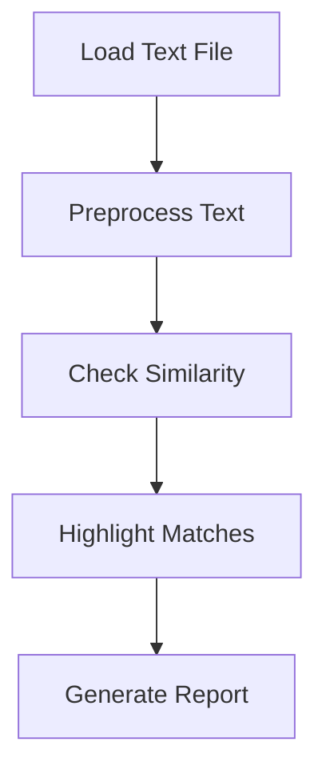

### README.md

# Cribbed Checker

A lightweight tool to detect and highlight copied or repetitive text segments in academic writing, student reports, or documentation. Designed for educators and reviewers to maintain content integrity.

## Features

* Detects copied lines and phrases.
* Provides match scores.
* Easy-to-read output with highlighted matches.


## Installation

1. Download or clone the repository.
2. Ensure Python 3.8+ is installed.
3. Install dependencies:

   ```bash
   pip install -r requirements.txt
   ```

## Folder Structure

```
cribbed-checker/
├── cribbed_checker/        # Core logic
├── tests/                  # Unit tests
├── docs/                   # Documentation files
├── README.md               # Overview
```

## Example Input

```
"This is an original line.\nThis line is copied.\nThis line is copied."
```

---

## Running the Tool

```bash
python cribbed_checker/main.py --input sample.txt
```

## Output

* The terminal will show repeated/copy-paste lines.
* A report will be saved in `output/report.txt`.

## Parameters

* `--input` : Path to input text file
* `--threshold` : Similarity threshold (default = 0.8)

---

### docs/architecture.md

# Architecture Overview

## Flow

1. Load input text.
2. Tokenize and normalize lines.
3. Compare similarity between each line.
4. Highlight matches exceeding threshold.
5. Output results.

## Diagram



---

### docs/faq.md

# FAQ / Troubleshooting

## Why is my file not being read?

Ensure the file path is correct and file is UTF-8 encoded.

## Why are some repeated lines not flagged?

Check if they fall below the similarity threshold.

## How do I change match sensitivity?

Use the `--threshold` parameter.

← [Back to Main README](../README.md)